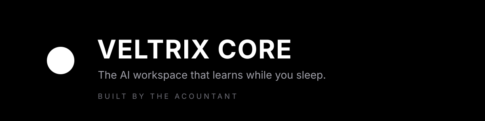

### Started as a white dot.

I'm **David**, also known as **The Acountant**. I build **[Veltrix Core](https://core.veltrix.com.ng)**, a privacy-first AI workspace with persistent memory.

---

**What I'm building**
- [Veltrix Core](https://core.veltrix.com.ng): memory, projects, tasks, and AI routing in one workspace

**Around here**
- Frontend dev in Abuja, Nigeria
- Teaching robotics and coding
- Stack: HTML, CSS, JavaScript, Python, Shopify themes

*Even dots can dream.*
